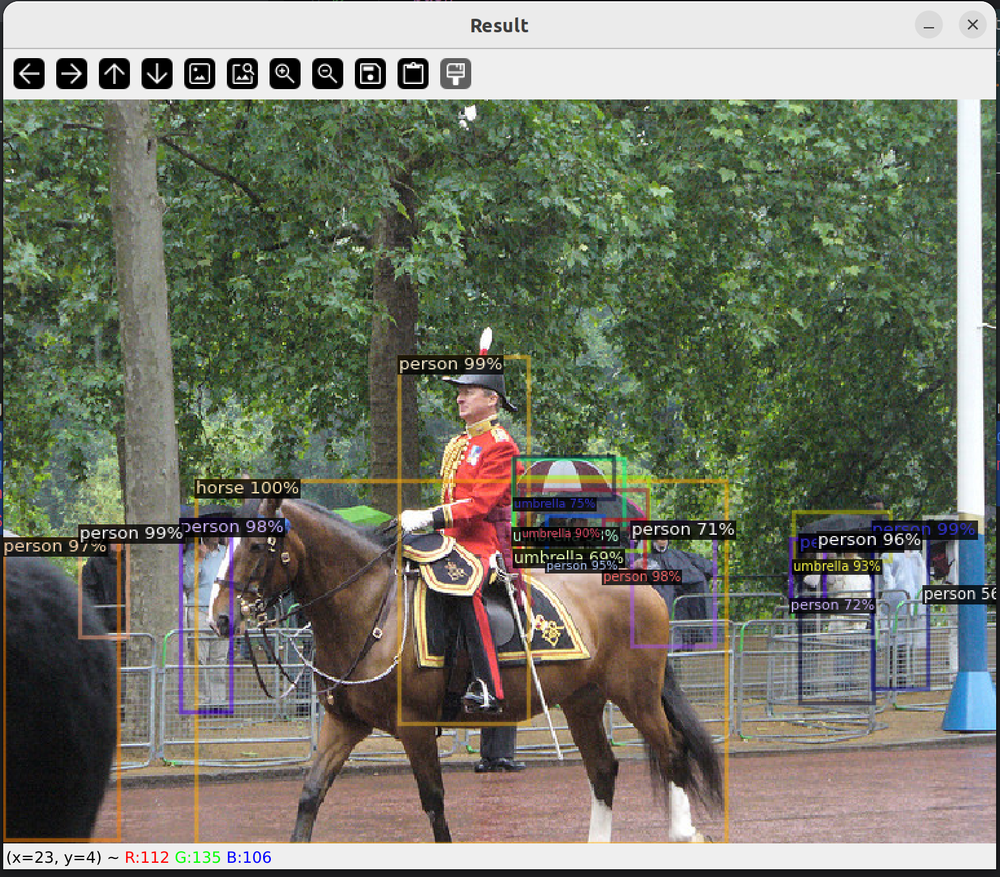

# Foreword
This repo was created for anyone curious as to what is going on with AMD GPUs, ROCm (Radeon Open Compute) and detectron2 implemented for Pytorch. 

Please stop by the following repo first [amd-gpu-hello](https://github.com/vampireLibrarianMonk/amd-gpu-hello) to get the computer build and the environment setup.

# Prerequisites
  * Compatible AMD GPU
  * ROCm-supported OS (e.g., Ubuntu 22.04.3 LTS)

# Getting Started
1. Create a Python Environment
Use mamba to create a new Python environment. If mamba is not installed, you can use conda as an alternative.
```bash
mamba create --name detectron2-rocm python=3.10 -y
mamba activate detectron2-rocm
```

2. Download and install PyTorch and torchvision wheels compatible with ROCm.
```bash
wget https://repo.radeon.com/rocm/manylinux/rocm-rel-5.7/torch-2.0.1%2Brocm5.7-cp310-cp310-linux_x86_64.whl
wget https://repo.radeon.com/rocm/manylinux/rocm-rel-5.7/torchvision-0.15.2%2Brocm5.7-cp310-cp310-linux_x86_64.whl
pip3 install --force-reinstall torch-2.0.1+rocm5.7-cp310-cp310-linux_x86_64.whl torchvision-0.15.2+rocm5.7-cp310-cp310-linux_x86_64.whl 
```

3. Install Detectron2 Dependencies
```bash
pip3 install cython
pip3 install opencv-python
pip3 install 'git+https://github.com/facebookresearch/fvcore'
pip3 install iopath
```

4. Install Detectron2
```bash
git clone https://github.com/facebookresearch/detectron2.git
python -m pip install -e detectron2
```

5. Pycharm was used to execute this project.  Ensure you use the following environment variables (6600 XT) when executing run_detectron2_hello_world.
```bash
HSA_OVERRIDE_GFX_VERSION=10.3.0
```

6. Running run_detectron2_hello_world should result in the following:

Result Bash:
```bash
[01/01 19:11:28 d2.checkpoint.detection_checkpoint]: [DetectionCheckpointer] Loading from https://dl.fbaipublicfiles.com/detectron2/COCO-Detection/faster_rcnn_R_50_FPN_3x/137849458/model_final_280758.pkl ...
/home/flaniganp/mambaforge/envs/detectron2-rocm/lib/python3.10/site-packages/torch/functional.py:504: UserWarning: torch.meshgrid: in an upcoming release, it will be required to pass the indexing argument. (Triggered internally at ../aten/src/ATen/native/TensorShape.cpp:3483.)
  return _VF.meshgrid(tensors, **kwargs)  # type: ignore[attr-defined]
Warning: Ignoring XDG_SESSION_TYPE=wayland on Gnome. Use QT_QPA_PLATFORM=wayland to run on Wayland anyway.
```

Result Image: 
